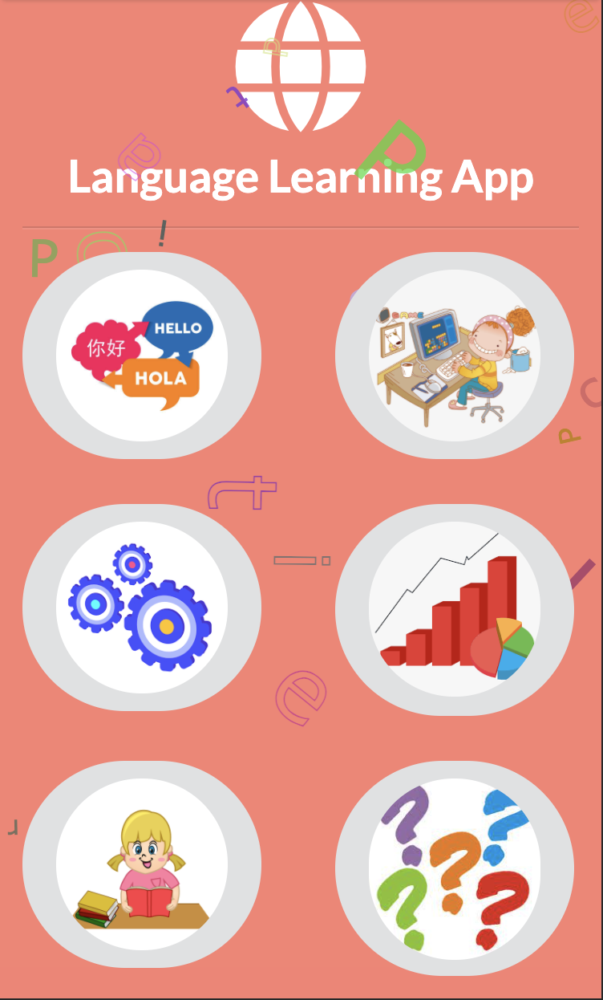
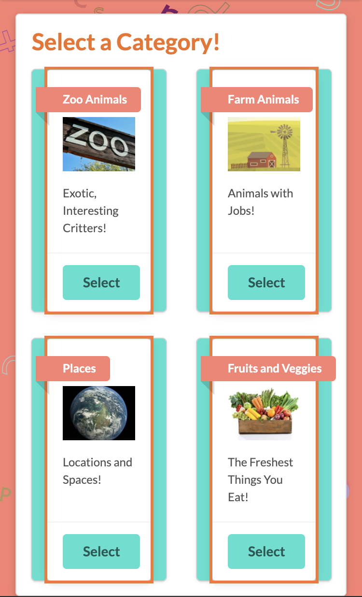
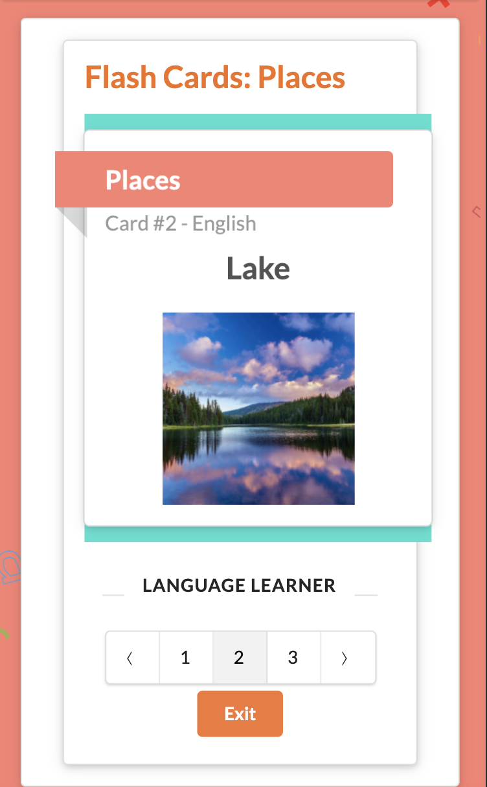
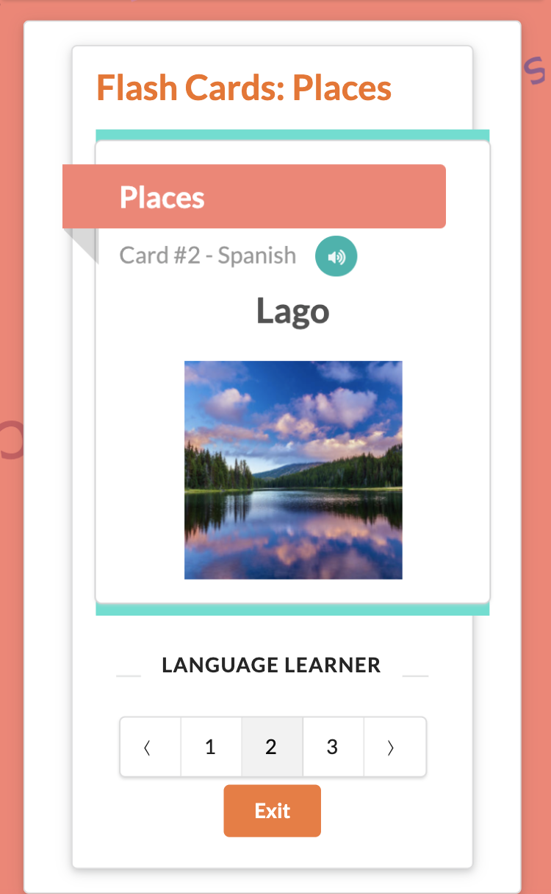
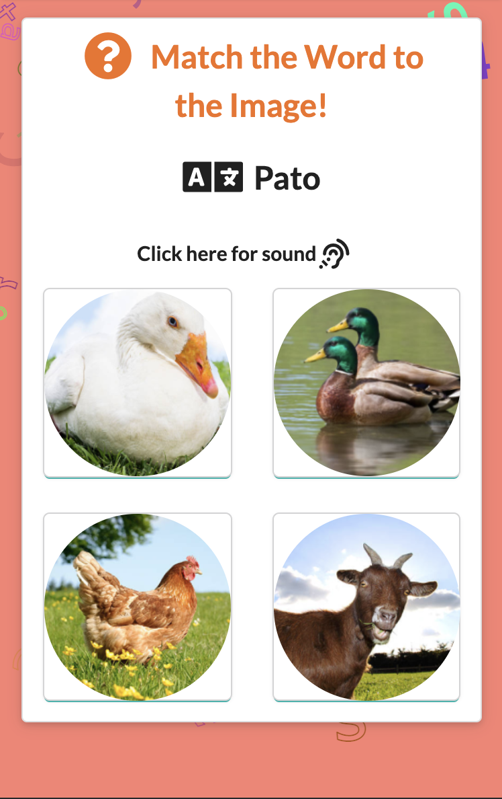
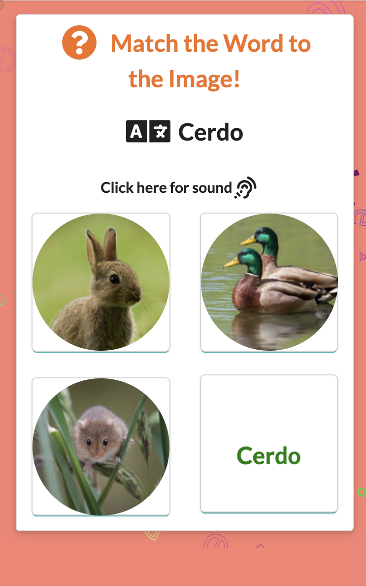
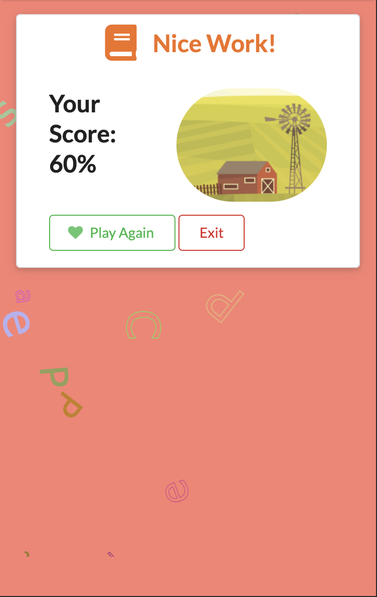

# Learnt-Up

https://opensource.org/licenses/MIT

## Description

Welcome to Learnt Up! A mobile-first language learning application geared towards teaching young learners basic vocabulary in other languages (current primary focus is Spanish and then French, with plenty more to follow). Learnt Up is packed with features that make learning a new language both easy and fun.
      
## Table of Contents 
      
* [Installation](#installation)
      
* [Usage](#usage)
      
* [Contributing](#contributing)

* [Login](#login)

* [Homepage](#Homepage)

* [Translate](#translate)
      
* [Play](#play)

* [Flashcards](#flashcards)

* [Challenge](#challenge)

* [Stats](#Stats)

* [Settings](#Settings)

* [Technologies](#Technologies)
      
* [Questions](#questions)

* [License](#license)
      
## Installation

Clone the application from the learning app repository and run 'npm install' to install all dependencies.
      
## Usage

This application is buildt around several 'mini-apps' each with their own usage. Learnt Up features: A text translator, a card matching game, a challenge/quiz, review flashcards, settings with the option to change the username or language, and a stats page that stores analytics from each other mini-app.
        
## Contributing

If you would like to contribute to this project, create a pull request with a complete description of your contribution and send it to our repository.
      
## Login
      
Learnt-Up utilizes Firebase login. Currently, the user is able to login with their Gmail account.

## Homepage
      
From the Homepage the user can navigate to any other page in the application using either the icons or the dropdown nav bar. The user also has the option to sign-out of Learnt Up.

## Translate
      
This application features a translation tool powered by Google Translate to translate words quickly from Spanish and French into English. The user enters the word they would like to translate into the input box, and upon tapping the 'translate' button the word will be translated using the Google Translate API

## Play
      
This application features an interactive card-matching game. The user selects a topic category and is then presented with rows of cards, face down. The user may select two cards, and if they are a match the cards will remain face-up. If not, the cards are turned back over and the user continues to search for matches.

## Flashcards
      
The user may access the flashcard page to view flashcards for reviewing language and learning new vocabulary. Upon selecting 'Flashcards' from the landing page, the user is presented with several different categories- zoo animals, places, etc. to choose from. 

Once the user selects a category, the flashcard collection generates and the user can page through each card in order. The user can click the card to flip it and reveal the word in the language being learned. 

Clicking the small audio icon on the card will play audio of the correct pronunciation of the target word (currently only available in Spanish). Upon clicking exit, the number of flashcards viewed by the user will be posted in the database.
      
## Challenge
      
The Challenge mini-app engages the user in a short multiple choice quiz that drills the user on vocabulary randomly selected from a chosen category of words. The user first selects a topic category, and then five words from the chosen topics are selected at random and presented to the user with four pictures to choose from.

After playing five rounds, the users results are displayed and posted to the stats databse.

## Stats
      
All three of the interactive apps feed information in a stats database that tracks flashcards viewed, quiz results, and game results for each unique user.

## Settings
      
From settings, the user can manually set a custom username and select which language they'd like to use (currently limited to Spanish and French)

## Technologies
      
Learnt-Up utilizes several technologies to achieve its functionality:

    - React.js
    - Semantic-UI
    - React-Spring
    - Particle-React
    - Express
    - Mongoose
    - MongoDB Atlas
    - Webster's Dictionary API
    - Google Translate

## Questions

For questions regarding this repo contact one of the developers:

    - charlie.bateman117@gmail.com 
    - kurt_phillips@live.com
    - eh26steve@gmail.com
    - erik.justin.portillo@gmail.com
    - flemingdestiny7401@gmail.com

or visit their repositories: 

    - https://github.com/Clatrobe00
    - https://github.com/kurtp23
    - https://github.com/rasputinforever
    - https://github.com/Eliuth4k9
    - https://github.com/Destinyfleming

## License

Copyright 2021 MIT

    Permission is hereby granted, free of charge, to any person obtaining a copy of this software and associated documentation files (the "Software"), to deal in the Software without restriction, including without limitation the rights to use, copy, modify, merge, publish, distribute, sublicense, and/or sell copies of the Software, and to permit persons to whom the Software is furnished to do so, subject to the following conditions:
    
    The above copyright notice and this permission notice shall be included in all copies or substantial portions of the Software.
    
    THE SOFTWARE IS PROVIDED "AS IS", WITHOUT WARRANTY OF ANY KIND, EXPRESS OR IMPLIED, INCLUDING BUT NOT LIMITED TO THE WARRANTIES OF MERCHANTABILITY, FITNESS FOR A PARTICULAR PURPOSE AND NONINFRINGEMENT. IN NO EVENT SHALL THE AUTHORS OR COPYRIGHT HOLDERS BE LIABLE FOR ANY CLAIM, DAMAGES OR OTHER LIABILITY, WHETHER IN AN ACTION OF CONTRACT, TORT OR OTHERWISE, ARISING FROM, OUT OF OR IN CONNECTION WITH THE SOFTWARE OR THE USE OR OTHER DEALINGS IN THE SOFTWARE.